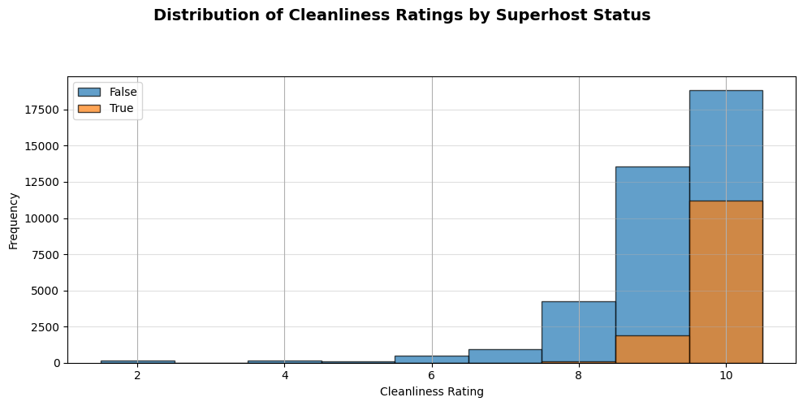
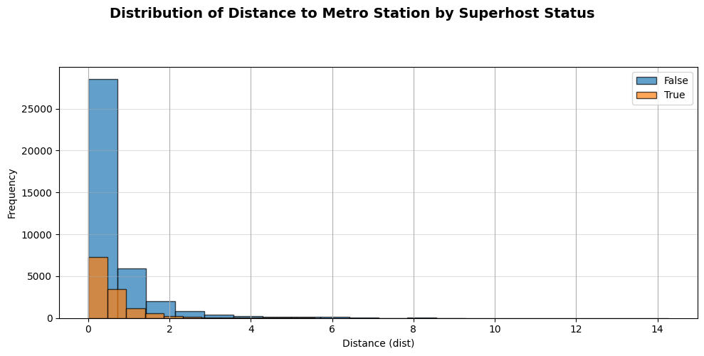
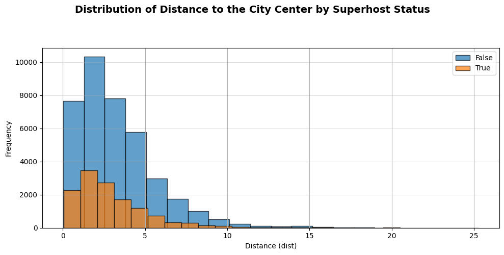
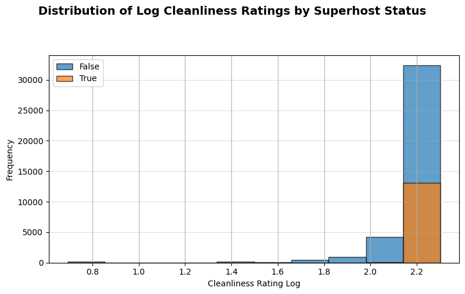
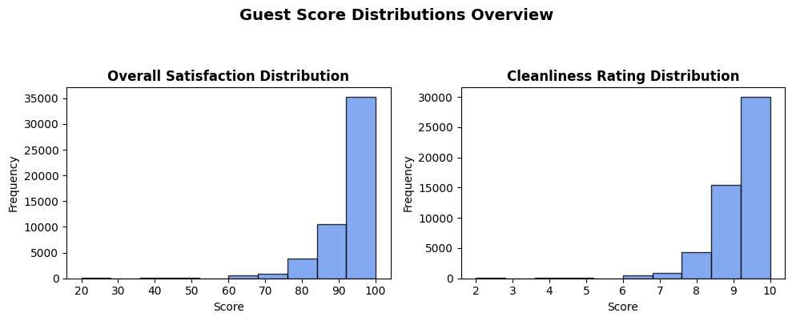
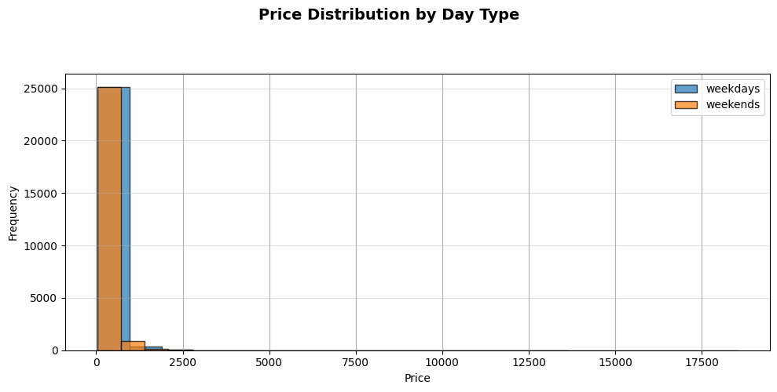
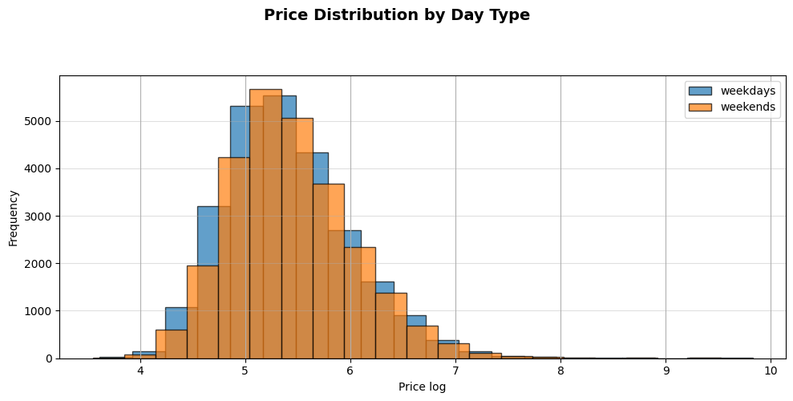

# Airbnb Europe: Exploratory Data Analysis Report

**0. Authors of the report**

| Name | Contribution |
| :--- | :--- |
| Group 4 (Betül) | Data loading, cleaning, feature engineering, analysis, and visualization. |
| Group 4 (Tejas) | Data loading, cleaning, feature engineering, and report preparation. |
| Group 4 (Julian Hermes) | Data loading, cleaning, feature engineering, and report preparation. |

---

**1. Dataset Overview**

| Item | Description |
| :--- | :--- |
| **Dataset name** | Airbnb |
| **Number of rows** | 51,707 |
| **Number of columns** | 25 (after cleaning & feature engineering) |
| **Format file** | .xlsx (from Google Sheets) |
| **Authors of the dataset** | Not specified |
| **Source (name)** | Google Sheets |
| **Source (link)** | `https://docs.google.com/spreadsheets/d/1ecopK6oyyb4d_7-QLrCr8YlgFrCetHU7-VQfnYej7JY/edit?gid=1813557111#gid=1813557111` |

---

**2. Dataset Structure**

| Feature/variable | Data type | Description | Number of Unique values | Example values |
| :--- | :--- | :--- | :--- | :--- |
| `Price` | float64 | Price per night (originally `realSum`) | 46,263 | `194.03`, `344.25` |
| `room_type` | object | Type of listing | 3 | `Private room`, `Entire home/apt` |
| `room_shared` | bool | Boolean flag for shared room | 2 | `False` |
| `room_private` | bool | Boolean flag for private room | 2 | `True`, `False` |
| `person_capacity` | int64 | Maximum guest capacity | 4 | `2`, `4` |
| `host_is_superhost` | bool | Boolean flag for Superhost status | 2 | `False`, `True` |
| `multi` | int64 | Host has 2-4 listings (binary flag) | 2 | `1`, `0` |
| `biz` | int64 | Host has >4 listings (binary flag) | 2 | `0`, `1` |
| `cleanliness_rating` | int64 | Guest rating for cleanliness (2-10) | 9 | `10`, `8` |
| `guest_satisfaction_overall` | int64 | Overall guest satisfaction (20-100) | 81 | `100`, `95` |
| `bedrooms` | int64 | Number of bedrooms | 10 | `1`, `2` |
| `dist` | float64 | Distance to city center (km) | 51,438 | `5.02`, `0.49` |
| `metro_dist` | float64 | Distance to nearest metro (km) | 50,706 | `2.54`, `0.24` |
| `attr_index` | float64 | Attraction index score | 51,698 | `78.69`, `631.18` |
| `attr_index_norm` | float64 | Normalized attraction index | 51,698 | `4.17`, `33.42` |
| `rest_index` | float64 | Restaurant index score | 51,701 | `98.25`, `837.28` |
| `rest_index_norm` | float64 | Normalized restaurant index | 51,701 | `6.85`, `58.34` |
| `lng` | float64 | Longitude | 51,684 | `4.90`, `16.38` |
| `lat` | float64 | Latitude | 51,684 | `52.42`, `48.21` |
| `city` | object | City of the listing | 10 | `amsterdam`, `vienna` |
| `weekday/weekend` | object | Indicates if listing is for weekday/weekend | 2 | `weekdays`, `weekends` |
| `country` | object | Country of the listing | 10 | `netherlands`, `austria` |
| `nlist_by_hosts` | object | Host category based on listing count | 3 | `1`, `2-4`, `more than 4` |
| `shared/private` | object | Room privacy status (flawed column) | 1 | `private` |

---

**3. Data cleaning**

| Issue | Names of Columns affected | Description of the Issue | Action Taken |
| :--- |:-------------------------------------| :--- | :--- |
| **Inconsistent column labeling** | `realSum` | Column name was not descriptive. | Renamed `realSum` to `Price`. |
| **Wrong data types** | | No major issues identified; data loaded with appropriate types. | No action needed. |
| **Missing values** | No columns | All columns had 51,707 non-null entries. | No action needed. |
| **Duplicates** | | | Not explicitly checked or removed. |
| **Inconsistent categories** | `sheet_name`, `multi`, `biz` | `sheet_name` contained two variables (city and day type). `multi` and `biz` were binary flags for host listing counts. | `sheet_name` was split into new `city` and `weekday/weekend` columns. `multi` and `biz` were combined into a single categorical column `nlist_by_hosts` ("1", "2-4", "more than 4"). |
| **Other** | `index`, `sheet_name`, `sheet_name2` | These columns were redundant after feature engineering. | Dropped the specified columns. |
| **Other** | `country` | Country data was missing. | A new `country` column was added by merging with an external city-country mapping. |
| **Other** | `shared/private` | A new column was intended to categorize listings. | A coding error in the notebook (iterative assignment to the entire column) resulted in all 51,707 rows being assigned the value 'private'. This column was not used for analysis. |
| **Other** | `Price`, `dist`, `metro_dist` | These columns were highly right-skewed, which can affect statistical analysis. | Log-transformed columns (`price_log`, `dist_log`, `metro_dist_log`) were created for use in statistical tests. |

---

**4. Descriptive statistics**

**Numeric columns**

| | Price | person_capacity | guest_satisfaction_overall |
| :--- | :--- | :--- | :--- |
| **Count** | 51,707 | 51,707 | 51,707 |
| **Mean** | 279.88 | 3.16 | 92.63 |
| **Std** | 327.95 | 1.30 | 8.95 |
| **Min** | 34.78 | 2.0 | 20.0 |
| **25%** | 148.75 | 2.0 | 90.0 |
| **50%** | 211.34 | 3.0 | 95.0 |
| **75%** | 319.69 | 4.0 | 99.0 |
| **Max** | 18,545.45 | 6.0 | 100.0 |

**Category columns**

| | room_type | host_is_superhost | city |
| :--- | :--- | :--- | :--- |
| **Count** | 51,707 | 51,707 | 51,707 |
| **Unique** | 3 | 2 | 10 |
| **Top** | Entire home/apt | False | london |
| **Freq. Top**| 32,648 | 38,475 | 9,993 |
| **Least** | Shared room | True | amsterdam |
| **Freq. Least**| 366 | 13,232 | 2,080 |

---

**5. Analysis - Research question**

This analysis explores patterns in Airbnb listings, pricing, and host characteristics across ten major European cities.

### Listing Distribution and Characteristics

* **Listings per City:** The dataset covers 51,707 listings. The distribution is uneven across cities, with **London** having the most listings (9,993) and **Amsterdam** having the fewest (2,080).
* **Room Type:** The most common listing type is **'Entire home/apt'** (32,648 listings), followed by 'Private room' (18,693) and 'Shared room' (366). **Rome** has the highest number of 'Entire home/apt' listings (5,561).
* **Guest Capacity:** The most common listing capacity is for **2 people**, which is also the minimum capacity available in the dataset.
* **High-Capacity Listings:** Listings with more than 4 bedrooms are very rare but were found in **Amsterdam, Berlin, Barcelona, Lisbon, London, Paris, and Rome**.

### Guest Satisfaction

Guest ratings are **overwhelmingly positive** across the dataset. Both `guest_satisfaction_overall` and `cleanliness_rating` distributions are heavily left-skewed.
* **Overall Satisfaction:** The median score is **95 out of 100**, with 75% of listings scoring 90 or above.
* **Cleanliness:** The median rating is **10 out of 10**, with 75% of listings scoring 9 or above.

### Pricing Analysis

Prices are heavily right-skewed (a few very expensive listings pull up the mean), so a log-transformed price (`price_log`) was created and used for comparative analysis.

* **Weekend vs. Weekday Pricing:** Listings are significantly more expensive on **weekends** compared to weekdays (t-stat: -7.25, p-value: 4.24e-13).
* **Price by Room Type:** As expected, **'Entire home/apt'** listings are significantly more expensive than 'Private room' listings (t-stat: 82.0, p-value: 0.0). This trend is consistent across all 10 cities. The price gap, however, varies by city; it is most pronounced in Barcelona (median log-price 6.21 vs. 5.23) and smallest in Paris (5.83 vs. 5.54).
* **City-to-City Price Comparison:** Significant price differences exist between cities (p < 0.001 for all comparisons):
    * **Amsterdam** is significantly more expensive than **Berlin** (t-stat: 37.98, p-value: 8.11e-245).
    * **Rome** is significantly more expensive than **Athens** (t-stat: -28.03, p-value: 1.84e-161).
    * **Barcelona** is significantly more expensive than **Lisbon** (t-stat: 5.82, p-value: 6.80e-09).

### Superhost Analysis

This analysis explored what differentiates Superhosts from normal hosts.

* **Prevalence:** Superhost status is not evenly distributed. **Athens** has the highest proportion of Superhosts (43%), while **Paris** (14%) and **London** (16%) have the lowest.
* **Pricing:** Contrary to what one might expect, listings by Superhosts are significantly **less expensive** than those by normal hosts (t-stat: -16.82, p-value: 3.98e-63).
* **Location:**
    * Superhosts are significantly **closer to the city center** (lower log-distance) than normal hosts (t-stat: -13.54, p-value: 1.29e-41).
    * However, they are also significantly **further from the nearest metro station** (higher log-distance) (t-stat: 5.17, p-value: 2.41e-07). This suggests Superhosts may be concentrated in central, walkable neighborhoods where immediate metro access is less critical.
* **Cleanliness:** Superhosts are demonstrably cleaner. A Mann-Whitney U test (used for the skewed rating data) confirms that Superhosts have significantly **higher cleanliness ratings** (median 10/10) than normal hosts (median 9/10) (p-value: 0.0).
* **Room Type:** There is a significant association between room type and Superhost status (Chi-Square p-value: 0.0000). The status is most common for **'Entire home/apt'** (27.4% of these hosts are Superhosts) and least common for **'Shared room'** (only 11.2% are Superhosts).

---

## 6. Visualizations

### 1. Distribution of Cleanliness Ratings by Superhost Status

### 2. Distribution of Distance to Metro Station by Superhost Status

### 3. Distribution of Distance to the City

### 4. Distribution of Log Cleanliness Rating by Superhost Status

### 5. Guest Score Distributions Overview

### 6. Price Distribution by Day Type

### 7. Price Distribution by Day Type (Alternative)

---

## 7. Conclusion

The Airbnb dataset highlights consistent trends across European cities:
* Superhosts maintain higher cleanliness and guest satisfaction ratings.
* Prices differ strongly by city and room type.
* Weekend stays are typically more expensive.
* Central locations correlate with Superhost listings but often have less metro proximity.

This analysis provides an initial foundation for deeper modeling, such as predicting Superhost likelihood or optimizing dynamic pricing across locations.

---

## 8. AI Disclaimer

I used AI tools to assist in performing **Chi-Square** and **Mann-Whitney U** statistical tests, as well as for generating parts of the written analysis and visualization explanations. All final interpretations, coding, and conclusions were reviewed and verified manually.
