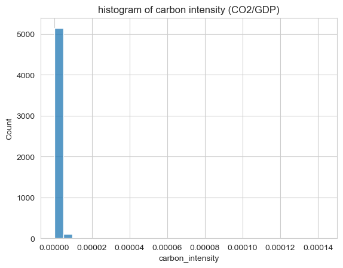
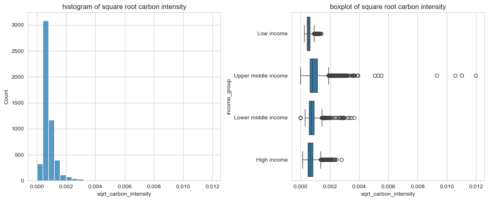
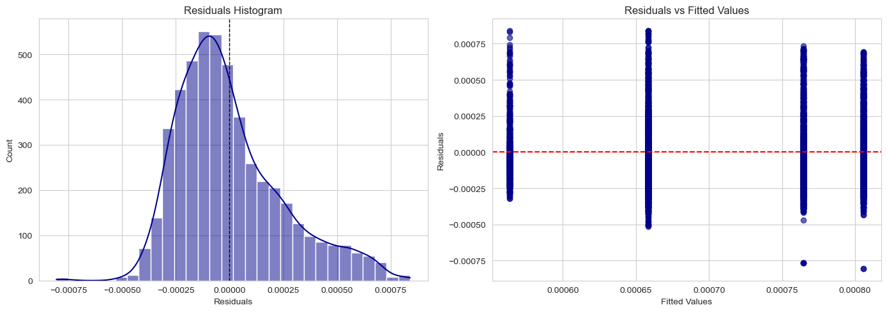
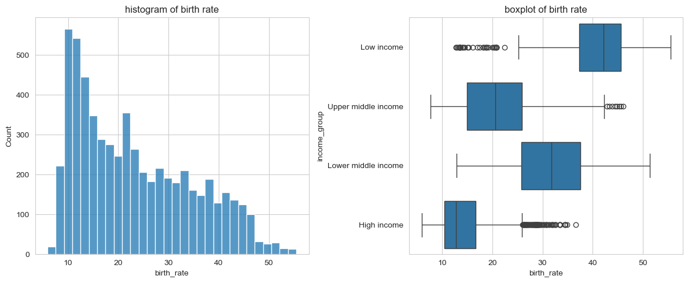
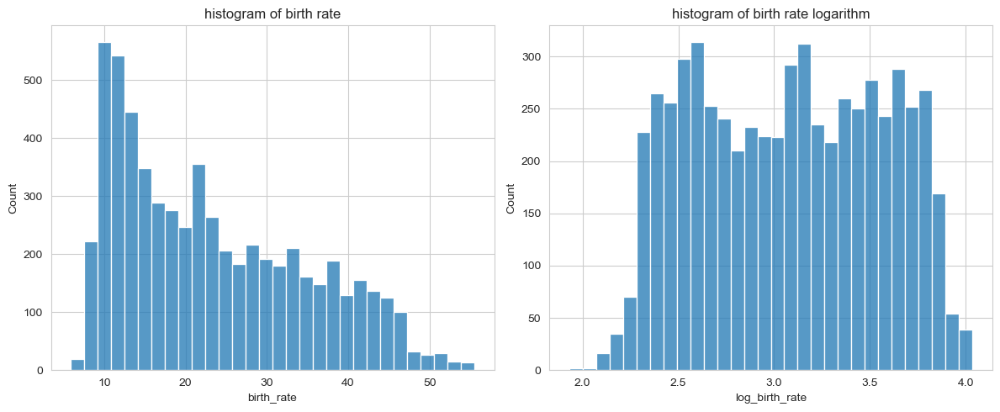
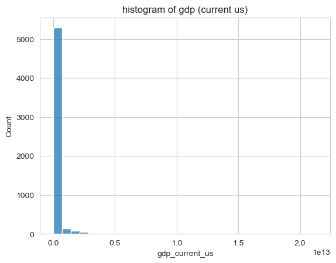
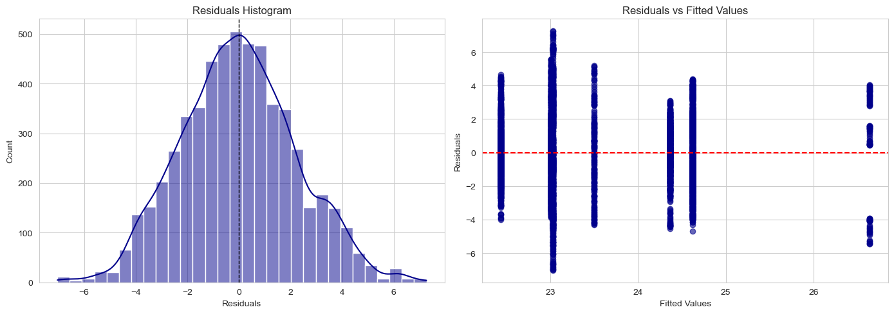

# World Bank Project Report: Global Development Inequalities

## 0. Authors of the report
* **Name:** Group 4 Data Analysis Team
*  Betul: Data Cleaning, Statistical Analysis, Visualisation, Reporting
*  Tejas: Data Cleaning, Statistical Analysis, Visualisation
*  Julian: Reporting

---

## 1. Dataset Overview

| Item | Description |
| :--- | :--- |
| **Dataset name** | World Bank Development Indicators |
| **Number of rows** | 17,272 (Initial Raw Data) |
| **Number of columns** | 52 |
| **Format file** | .csv |
| **Authors of the dataset** | The World Bank Group |
| **Source (name)** | World Bank Open Data |
| **Source (link)** | [data.worldbank.org](https://data.worldbank.org/) |

---

## 2. Dataset Structure

We are reducing the dataset to the most relevant columns to make this overview more usefull and structured.

The dataset contains a mix of categorical and numerical variables representing development metrics across countries and years.

| Feature/variable | Data type | Description | Example |
| :--- | :--- | :--- | :--- |
| `country` | Object | Name of the country or region | "Afghanistan" |
| `income_group` | Object | Economic classification of the country | "Low income" |
| `life_expectancy_at_birth` | Float | Average years a newborn is expected to live | 64.84 |
| `gdp_current_us` | Float | Gross Domestic Product in current US dollars | 2.57e+10 |
| `co2_emissions` | Float | Carbon dioxide emissions (metric tons per capita) | 4.5 |
| `access_to_electricity` | Float | Percentage of population with access to electricity | 80.97 |

---

## 3. Data Cleaning

The raw data required several processing steps to ensure quality and consistency for analysis.

| Issue | Affected Columns | Description of the Action Taken |
| :--- | :--- | :--- |
| **Inconsistent column labeling** | All Columns | Standardized names: converted to lowercase, stripped whitespace, and replaced spaces with underscores (e.g., `Birth Rate` $\to$ `birth_rate`). |
| **Missing values** | `income_group` | Dropped rows where `income_group` was missing to ensure valid comparative analysis. |
| **Missing values** | `life_expectancy_at_birth` | Dropped approximately 1,000 rows with null values to allow for accurate health trend analysis. |
| **Duplicates** | All Columns | Verified the dataset for duplicate entries (0 duplicates found). |
| **Data Integration** | `Region`, `Income` | Merged the main dataset with `income.xlsx` metadata to add `Region` and `Income group` classifiers to each country. |

---

## 4. Descriptive Statistics

Summary of key numeric indicators after cleaning:

| Column | Count | Mean | Std | Min | 25% | 50% | 75% | Max |
| :--- | :--- | :--- | :--- | :--- | :--- | :--- | :--- | :--- |
| **Agricultural Land (%)** | 10,872 | 36.86 | 22.43 | 0.26 | 17.77 | 37.65 | 54.71 | 93.44 |
| **Access to Electricity (%)** | 5,676 | 80.97 | 29.64 | 0.53 | 70.46 | 99.09 | 100.0 | 100.0 |
| **Renewable Energy (%)** | 6,147 | 30.65 | 30.38 | 0.00 | 3.73 | 19.78 | 53.02 | 98.34 |
| **Life Expectancy (Years)** | 12,337 | 64.84 | 11.26 | 11.99 | 57.95 | 67.66 | 73.08 | 85.50 |
| **CO2 Emissions** | 7,408 | - | - | - | - | - | - | - |

---

## 5. The Data Story: Competing for a Better Future

Our analysis of the World Bank data tells a story of a world divided by economic fortune but connected by shared challenges. By segmenting countries into **High**, **Upper-Middle**, **Lower-Middle**, and **Low** income groups, distinct patterns emerge that define the global development landscape.

### I. The Privilege of Long Life
The most striking inequality is visible in **Life Expectancy**. 
* **The Gap:** There is a dramatic staircase effect. High-income nations sit at the top with life expectancies averaging over 70 years, while Low-income nations struggle in the low 50s.
* **The Driver:** This disparity is strongly correlated with `gdp_current_us` and `access_to_electricity` (Correlation: 0.83), indicating that economic infrastructure is a prerequisite for public health.

### II. The Carbon Cost of Wealth
Prosperity comes with a price. Our analysis shows a strong positive correlation between **Income/GDP** and **CO2 Emissions**.
* **The Trend:** As countries climb the income ladder, their carbon footprint expands. High-income countries are the largest emitters per capita.
* **The Twist:** Interestingly, `renewable_energy_consumption` shows a *negative* correlation with income in many cases. This reveals that many low-income nations rely on traditional renewable biomass (wood/waste) for fuel, whereas developing middle-income nations switch to fossil fuels to power rapid industrialization. Only at the highest income levels do we see a technological return to modern renewables, creating a U-shaped sustainability curve.

#### **Average Carbon Intensity (CO2 / GDP) by Income Group**

| Income Group | Carbon Intensity (Scaled Average $\text{CO}_2$ / GDP) |
| :--- | :--- |
| **Upper middle income** | $1.695194$ |
| **Lower middle income** | $0.835624$ |
| **High income** | $0.650598$ |
| **Low income** | $0.359056$ |

Interpretation: A lower intensity suggests more economically efficient (cleaner) production.

*   The analysis of average Carbon Intensity ($\text{CO}_2$/ GDP) shows a non-monotonic trend where the Upper middle income group is the most intensive (1.675 tons $\text{CO}_2$ per Million USD GDP), while the High income group is significantly cleaner (0.647 tons), reflecting improved efficiency post-industrialization.

*   Data is left skewed. We try square root transformation.

*   Data is right skewed even after square root transformation. We will try to clean outliers by using Interquartile Range (IQR) method.

*   The distribution is more normalized after we clean outliers. We can run Anova test now.

|      | sum\_sq | df | F | PR(>F) |
| :--- | :--- | :--- | :--- | :--- |
| **C(income\_group)** | $0.000034$ | $3.0$ | $186.506945$ | $1.233504 \times 10^{-114}$ |
| **Residual** | $0.000305$ | $4995.0$ | NaN | NaN |

*   Following the application of a square-root transformation and the removal of outliers via the IQR method to ensure the assumption of normality, a One-Way ANOVA was performed. The results revealed a highly statistically significant difference in the mean environmental efficiency ($\text{Sqrt}(\text{CO}_2/\text{GDP})$) across the four income groups ($F(3, 54995) = 186.51$, $\mathbf{P < 0.001}$). This strong significance rejects the null hypothesis, definitively confirming that the observed differences in mean Carbon Intensity—where the Upper Middle Income group is the most intensive and the High Income group is significantly cleaner—are not due to chance, but represent real structural variations in global economic development.

*  The diagnostic plots confirm the model's reliability. The Residuals Histogram shows the errors are roughly normally distributed, and because the sample size is large, the slight observed skewness does not undermine the analysis. Crucially, the Residuals vs Fitted Values plot confirms the error variance is consistent across all income groups. These successful checks validate the highly significant ANOVA finding ($\mathbf{P < 0.001}$), confirming that the differences in environmental efficiency are statistically robust.

Explained Variance: 0.101

*   The ANOVA test confirms that Income Group is a statistically significant factor in determining Carbon Intensity ( P<0.001 ). However, the model's Explained Variance ( R2 ) is low at 0.101. This means the income classification successfully shows that differences exist (statistical significance), but it only accounts for 10.1% of the total change in environmental efficiency. The remaining variability must be driven by other factors not included in this model, such as national energy policies or industrial structure.

Multiple Comparison of Means - Tukey HSD (FWER=0.05)

| group1 | group2 | meandiff | p-adj | lower | upper | reject |
| :--- | :--- | :--- | :--- | :--- | :--- | :--- |
| **High income** | **Low income** | $-0.0001$ | $0.0$ | $-0.0001$ | $-0.0001$ | True |
| **High income** | **Lower middle income** | $0.0001$ | $0.0$ | $0.0001$ | $0.0001$ | True |
| **High income** | **Upper middle income** | $0.0001$ | $0.0$ | $0.0001$ | $0.0002$ | True |
| **Low income** | **Lower middle income** | $0.0002$ | $0.0$ | $0.0002$ | $0.0002$ | True |
| **Low income** | **Upper middle income** | $0.0002$ | $0.0$ | $0.0002$ | $0.0003$ | True |
| **Lower middle income** | **Upper middle income** | $0.0000$ | $0.0001$ | $0.0000$ | $0.0001$ | True |

### III. The Digital and Physical Divide
Infrastructure metrics like `access_to_electricity` acts as gatekeepers to the modern economy.
* **High Income:** Near 100% saturation.
* **Low Income:** High variance, with many nations having less than 50% access. This infrastructure gap makes it exponentially harder for these economies to catch up, creating a feedback loop of inequality.

*  The Tukey HSD test confirmed that the differences in mean $\mathbf{\text{Sqrt}(\text{Carbon Intensity})}$ are statistically significant ($\mathbf{p < 0.05}$ for all pairs) between every income group pair. This analysis definitively validates the structural ranking of environmental efficiency, proving that the economic development phase is a genuine driver of relative pollution. Crucially, the test confirms that the Upper middle income group is statistically more carbon-intensive than the High income group ($\text{meandiff} = 0.0001, \mathbf{p=0.0}$), providing robust evidence that the peak environmental burden occurs precisely during the rapid industrialization stage.

### IV. The Demographic Transition: Life Expectancy vs. Birth Rate
A powerful indicator of a nation's development phase is the relationship between **Life Expectancy** and **Birth Rate**.
* **The Negative Correlation:** As shown in our scatter plots, there is a clear, strong negative correlation between these two variables. As nations develop, they trade high birth rates for longer lives.
  
* **The Clustering:** 
  * **Low Income / Developing:** These nations (often in Sub-Saharan Africa) appear in the top-left of the graph, characterized by high birth rates (30-45 births per 1000) and lower life expectancy (< 60 years).
  * **High Income / Developed:** These nations cluster in the bottom-right, with low birth rates (< 15 per 1000) and high life expectancy (> 75 years).
* **Statistical Significance:** Our ANOVA and Tukey post-hoc tests on `log_birth_rate` confirmed that these differences between income groups are statistically significant, verifying that the demographic shift is a fundamental structural change that accompanies economic growth.

#### **Birth Rate by Income Groups**

* It is right skewed. We try log-transformation:

*  The bimodal distribution observed after the log transformation is most likely a result of the distinct, separate characteristics of your different income groups, where each group clusters around its own average birth rate.

Anova test results:

| Kaynak | sum\_sq | df | F | PR(>F) |
| :--- | :--- | :--- | :--- | :--- |
| **C(income\_group)** | $886.614988$ | $3.0$ | $3281.471483$ | $0.0$ |
| **Residual** | $555.146760$ | $6164.0$ | NaN | NaN |

Null Hypothesis:  

$$H_0: \mu_{\text{High}} = \mu_{\text{Low}} = \mu_{\text{Lower Middle}} = \mu_{\text{Upper Middle}}$$

Which implies: There is no statistically significant difference in the mean of the dependent variable across the four income groups (High income, Low income, Lower middle income, and Upper middle income).

The ANOVA test shows a highly significant difference in the mean of the dependent variable across the income groups, with an extremely large F-statistic of 3281.47 and a P-value of $0.0$ (rejecting the null hypothesis).

*  The plot of residuals against fitted values reveals four distinct vertical clusters, as expected for a model with a categorical predictor. However, the variance of the residuals appears non-constant across these clusters, suggesting a violation of the homoskedasticity assumption. This non-random pattern indicates that the model's standard errors and the validity of inference may be compromised, despite the residuals reportedly being normally distributed.

Explained Variance: 0.615

*  Based on the **ANOVA** results, the income groups account for $61.5\%$ of the total variance in the dependent variable ($R^2 = 0.615$), which, combined with the significant F-statistic (3281.47) and $P$-value ($0.0$), confirms that the groups are a powerful and statistically significant predictor in the model.

Multiple Comparison of Means - Tukey HSD (FWER=0.05)

| group1 | group2 | meandiff | p-adj | lower | upper | reject |
| :--- | :--- | :--- | :--- | :--- | :--- | :--- |
| **High income** | **Low income** | $1.0368$ | $0.0$ | $1.0041$ | $1.0695$ | True |
| **High income** | **Lower middle income** | $0.7820$ | $0.0$ | $0.7561$ | $0.8078$ | True |
| **High income** | **Upper middle income** | $0.3632$ | $0.0$ | $0.3384$ | $0.3879$ | True |
| **Low income** | **Lower middle income** | $-0.2548$ | $0.0$ | $-0.2901$ | $-0.2195$ | True |
| **Low income** | **Upper middle income** | $-0.6736$ | $0.0$ | $-0.7082$ | $-0.6391$ | True |
| **Lower middle income** | **Upper middle income** | $-0.4188$ | $0.0$ | $-0.4469$ | $-0.3907$ | True |

*  **The Tukey HSD test** confirmed that the mean difference in $\mathbf{\text{Log}(\text{Birth Rate})}$ between every possible pair of income groups is statistically significant ($\mathbf{p < 0.05}$ for all pairs). This finding provides definitive quantitative support for the Demographic Transition Model, proving that each stage of economic development (income group) is associated with a unique and distinct average birth rate. The largest statistical difference was found between the two extremes, with Low income countries exhibiting a significantly higher mean birth rate than High income countries ($\text{meandiff} = 1.0368$).

### IV. GDP across Regions

* 	Data is left skewed. We will do log-transformation.

* 	Data is normalized after log-transformation. We can run ANOVA.

ANOVA Results:

| Kaynak | sum\_sq | df | F | PR(>F) |
| :--- | :--- | :--- | :--- | :--- |
| **C(region)** | $5118.571504$ | $6.0$ | $169.482345$ | $2.571617 \times 10^{-199}$ |
| **Residual** | $29390.808633$ | $5839.0$ | NaN | NaN |

* 	The ANOVA test confirms that Region is a highly statistically significant factor in determining a country's economic status, measured by $\text{Log}(\text{GDP})$. With a negligible $\mathbf{P\text{-value} \ (PR(>F) \approx 0.0)}$ and an extremely high $\mathbf{F\text{-statistic} \ (169.48)}$, the null hypothesis is strongly rejected. This result definitively proves that the average $\text{Log}(\text{GDP})$ varies significantly across the 7 regions, confirming that geography and regional economic structure are critical determinants of a country's wealth. The high F-statistic indicates that the variation explained by the regions ($\mathbf{sum\_sq} = 5118.57$) is substantially larger than the unexplained error.

* 	The diagnostic plots confirm the model's reliability for the ANOVA test. The Residuals Histogram shows the errors are roughly normally distributed, which is good. Although the Residuals vs Fitted Values plot suggests a slight violation of the homoskedasticity (unequal error spread) across the seven regional clusters, this is overcome by the large sample size. Because the test is robust, the finding that regions significantly affect $\text{Log}(\text{GDP})$ ($\mathbf{P < 0.001}$) remains highly reliable and valid.

Multiple Comparison of Means - Tukey HSD (FWER=0.05) by Region

| group1 | group2 | meandiff | p-adj | lower | upper | reject |
| :--- | :--- | :--- | :--- | :--- | :--- | :--- |
| **East Asia & Pacific** | Europe & Central Asia | $1.6432$ | $0.0$ | $1.3743$ | $1.9120$ | True |
| **East Asia & Pacific** | Latin America & Caribbean | $0.1379$ | $0.8119$ | $-0.1565$ | $0.4323$ | False |
| **East Asia & Pacific** | Middle East, North Africa, Afghanistan & Pakistan | $1.5015$ | $0.0$ | $1.1686$ | $1.8344$ | True |
| **East Asia & Pacific** | North America | $3.7841$ | $0.0$ | $3.0550$ | $4.5132$ | True |
| **East Asia & Pacific** | South Asia | $0.6362$ | $0.0087$ | $0.0992$ | $1.1731$ | True |
| **East Asia & Pacific** | Sub-Saharan Africa | $-0.4265$ | $0.0002$ | $-0.7083$ | $-0.1448$ | True |
| Europe & Central Asia | Latin America & Caribbean | $-1.5052$ | $0.0$ | $-1.7675$ | $-1.2430$ | True |
| Europe & Central Asia | Middle East, North Africa, Afghanistan & Pakistan | $-0.1416$ | $0.8178$ | $-0.4465$ | $0.1632$ | False |
| Europe & Central Asia | North America | $2.1409$ | $0.0$ | $1.4242$ | $2.8577$ | True |
| Europe & Central Asia | South Asia | $-1.0070$ | $0.0$ | $-1.5270$ | $-0.4870$ | True |
| Europe & Central Asia | Sub-Saharan Africa | $-2.0697$ | $0.0$ | $-2.3177$ | $-1.8217$ | True |
| Latin America & Caribbean | Middle East, North Africa, Afghanistan & Pakistan | $1.3636$ | $0.0$ | $1.0360$ | $1.6912$ | True |
| Latin America & Caribbean | North America | $3.6462$ | $0.0$ | $2.9195$ | $4.3729$ | True |
| Latin America & Caribbean | South Asia | $0.4983$ | $0.0857$ | $-0.0354$ | $1.0319$ | False |
| Latin America & Caribbean | Sub-Saharan Africa | $-0.5645$ | $0.0$ | $-0.8399$ | $-0.2890$ | True |
| Middle East, North Africa, Afghanistan & Pakistan | North America | $2.2826$ | $0.0$ | $1.5394$ | $3.0257$ | True |
| Middle East, North Africa, Afghanistan & Pakistan | South Asia | $-0.8654$ | $0.0001$ | $-1.4212$ | $-0.3095$ | True |
| Middle East, North Africa, Afghanistan & Pakistan | Sub-Saharan Africa | $-1.9281$ | $0.0$ | $-2.2444$ | $-1.6118$ | True |
| North America | South Asia | $-3.1479$ | $0.0$ | $-4.0022$ | $-2.2937$ | True |
| North America | Sub-Saharan Africa | $-4.2106$ | $0.0$ | $-4.9323$ | $-3.4890$ | True |
| South Asia | Sub-Saharan Africa | $-1.0627$ | $0.0$ | $-1.5896$ | $-0.5359$ | True |

* 	The Tukey HSD test confirmed that regional classification is a fundamental and statistically distinct determinant of national wealth, as 18 out of 21 regional comparisons showed a statistically significant difference ($\mathbf{P < 0.05}$). The analysis highlighted profound economic disparities, most notably that $\text{Log}(\text{GDP})$ in North America is significantly higher than in every other region, while the difference between East Asia & Pacific and Latin America & Caribbean was found to be statistically insignificant ($\mathbf{P=0.8119}$), suggesting their average wealth levels are comparable.

---
### V. Conclusion
The data suggests that economic development is the primary engine for improving human life span and basic access to services. However, the current model of development is resource-intensive. The challenge for the next century, as shown by the data, is to help Low and Middle-income countries achieve High-income health and infrastructure standards without replicating the high-carbon trajectory of the current wealthy nations.

---

